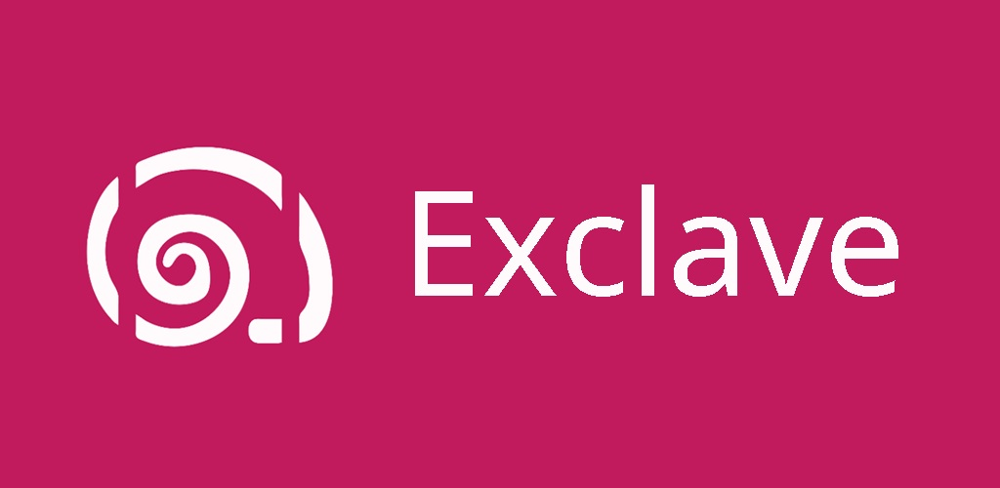
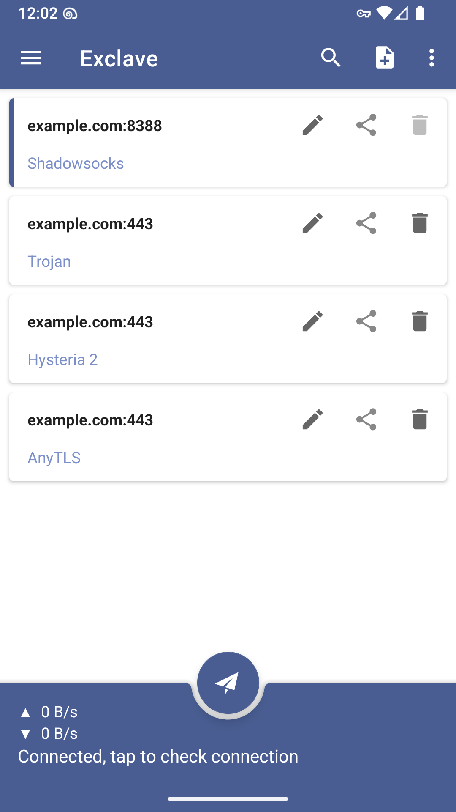
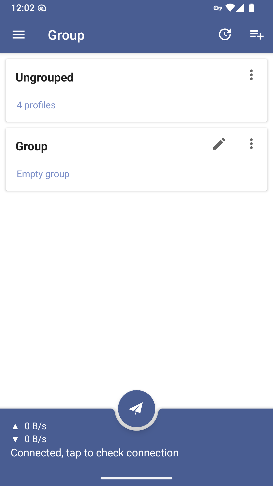
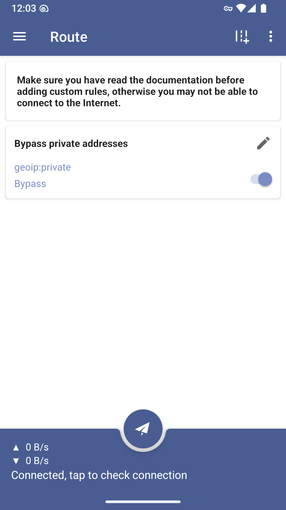
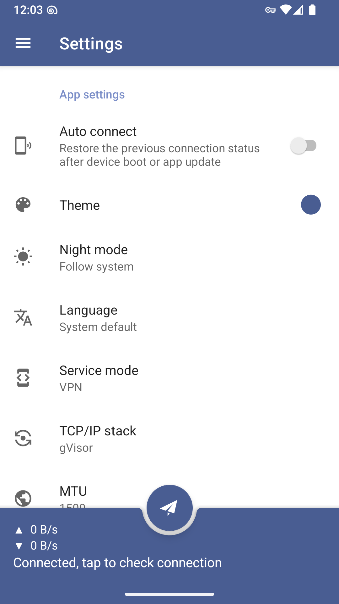
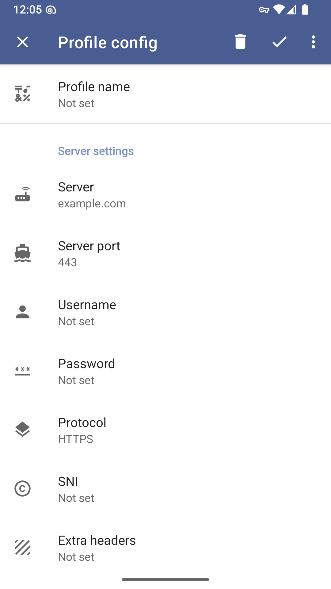

<div align="center">

# NexaProxy

**Мультипротокольный privacy-агрегатор прокси для Android**

Свободный, безопасный и быстрый VPN-клиент (псевдо-VPN), который объединяет десятки прокси-протоколов в одном приложении. Управляйте всем своим трафиком: подписки, цепочки, маршрутизация, по-приложная настройка.

[](https://github.com/hineeks/nexaproxy/releases)
[](https://github.com/hineeks/nexaproxy/actions/workflows/build.yml)
[](LICENSE)
[](build.gradle.kts)

<br />

<p align="center">
  
</p>

</div>

---

## Возможности

- **Мультипротокольность** — десятки прокси-протоколов из коробки.
- **Подписки и группы** — импорт ссылок, SIP002, SIP008, V2Ray, Clash, sing-box.
- **Прокси-цепочки** — объединяйте несколько серверов последовательно.
- **Маршрутизация** — гибкие правила для доменов, IP, стран, приложений.
- **По-приложный прокси** — включайте прокси только для выбранных приложений.
- **Балансировщики** — автоматический выбор сервера из группы.
- **VPN-режим** — работает как «псевдо-VPN» через системный VpnService.
- **Поддержка Tasker / Automate** — автоматизация переключений.
- Суб-поддержка многих новинок: AnyTLS, TUIC, Juicity, mieru, ShadowQUIC, TrustTunnel, SSH-tunnel.

## Поддерживаемые протоколы

| Протокол | Статус |
|---|---|
| Shadowsocks (+ SIP003 плагины) | ✅ |
| Shadowsocks 2022 (+ SIP003 плагины) | ✅ |
| Trojan | ✅ |
| Hysteria 2 | ✅ |
| AnyTLS | ✅ |
| mieru | ✅ |
| NaiveProxy (отдельный плагин) | ✅ |
| TUIC | ✅ |
| Juicity | ✅ |
| VMess / VLESS (со всеми под-протоколами) | ✅ |
| WireGuard (TCP/UDP) | ✅ |
| TrustTunnel | ✅ |
| Snell v4 / v6 | ✅ |
| ShadowQUIC | ✅ |
| SSH proxy (dynamic port forwarding) | ✅ |
| HTTP CONNECT (HTTP/1.1, HTTP/2, HTTP/3, TLS) | ✅ |
| SOCKS4 / SOCKS4A / SOCKS5 | ✅ |

## Скриншоты

<p align="center">
  
  
  
  
  
</p>

---

## Установка

Собранные APK доступны на вкладке [Releases](https://github.com/hineeks/nexaproxy/releases).

> NexaProxy — это **не** VPN в классическом понимании: он через системный VpnService забирает трафик и дальше гонит его по вашим прокси-серверам.

## Сборка из исходников

### Требования

- **JDK 21** (например Microsoft Build of OpenJDK 21)
- **Android SDK** (Platform 37, Build-Tools 37.0.0, NDK r29)
- **Go 1.27+** и **gomobile** — только если пересобираете ядро
- **Gradle 9.x** (обёртка в репозитории)

### Клонирование и сборка

```bash
git clone https://github.com/hineeks/nexaproxy.git
cd nexaproxy

# Windows
.\gradlew.bat :app:assembleOssRelease

# Linux / macOS
./gradlew :app:assembleOssRelease
```

Артефакты появятся в `app/build/outputs/apk/oss/release/`.

Подробная инструкция — в [docs/build-android.md](docs/build-android.md).

### CI

Репозиторий собирает APK автоматически в [GitHub Actions](https://github.com/hineeks/nexaproxy/actions) (workflow `build.yml`) при каждом push/PR.

## Помощь и обратная связь

- [Issues](https://github.com/hineeks/nexaproxy/issues) — баги и предложения.
- [Pull Requests](https://github.com/hineeks/nexaproxy/pulls) — вклад в код.
- [Releases](https://github.com/hineeks/nexaproxy/releases) — актуальные APK.

## Автор

Проект ведёт **hineeks**. Контакты для связи — в настройках магазина Google Play (`contact-email.txt`).

## Лицензия

Весь код репозитория распространяется на условиях **PolyForm Noncommercial License 1.0.0** ([LICENSE](LICENSE), [polyformproject.org](https://polyformproject.org/licenses/noncommercial/1.0.0)).

**Важно о JavaScript и ядре:** при сборке приложения используется ядро (Go-based core), которое собирается из исходников и зависит от библиотек, распространяемых под **GPL-3.0-only** (sing-box, xray и др.). Соответствующие уведомления находятся в `app/src/main/assets/license/` и в приложении (About → Licenses). Это не влияет на код самого приложения.

<br />

<div align="center">
  <strong>NexaProxy</strong> — с уважением к вашей приватности.
</div>